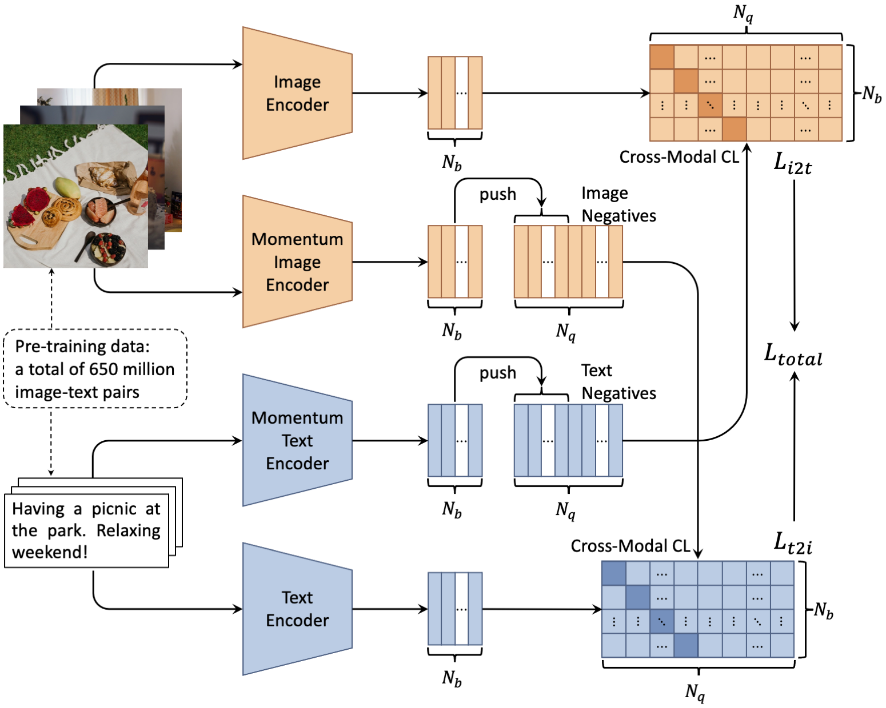

# BriVL
The code repository for our Nature Computational Science submission "Towards artificial general intelligence: self-supervised learning from huge multimodal data".

## BriVL (Bridging Vision and Language)

### Prerequisites

- Environment:
    - python 3.8.3
    - pathlib 2.3.5
    - yaml 0.2.5
    - easydict 1.9
    - pillow 7.2.0
    - numpy 1.18.5
    - pytorch 1.7.1
    - torchvision 0.8.2
    - transformers 4.6.1 ([installation instructions](https://huggingface.co/transformers/installation.html))
    - timm 0.4.9
- Pre-trained weights of BriVL w/ RoBERTa-base:
    - [Google Drive](https://drive.google.com/file/d/1zucMVRKMwAiW7SrDzHAwSyC3Cl7WSJJv/view?usp=sharing)
    - [Baidu Net Disk](https://pan.baidu.com/s/1TPChAqXiAI0EQ-UbQ5FtJA) (code: 6een)

Note that the pre-trained model should be put under the `./pretrained/` folder. We only release BriVL w/ RoBERTa-base when the paper is under review. And BriVL w/ RoBERTa-large pre-trained on the 650M data will be accessible after the paper is published.

### Feature Extraction

Code for image/text feature extraction and cross-modal similarity computation is presented in `example.py`. Please prepare `images.csv` and `texts.csv` under the `./input_data/` folder before running the code, where each line of `images.csv` should be the image file name and each line of `texts.csv` should be a piece of Chinese text.
